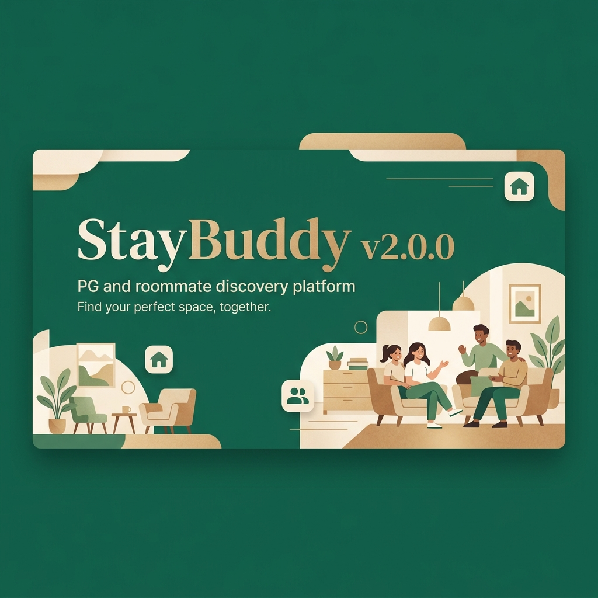
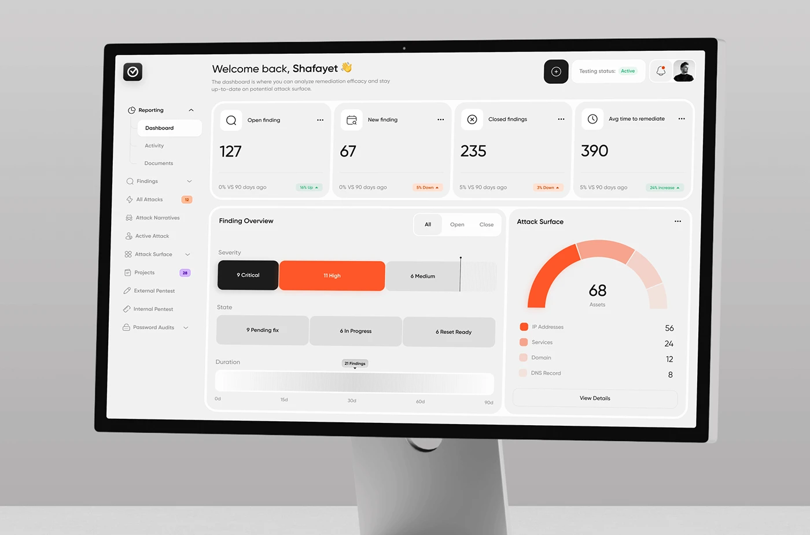
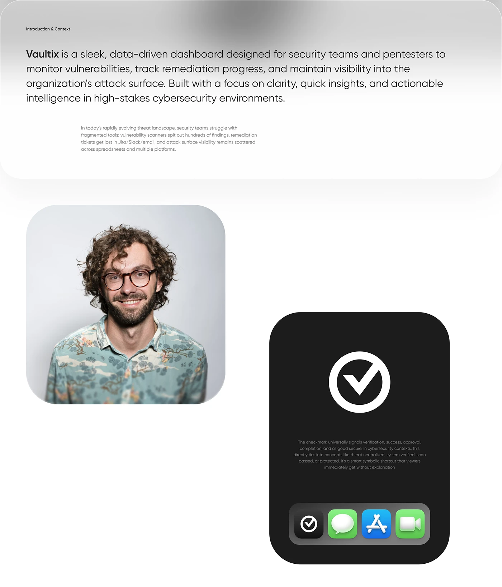
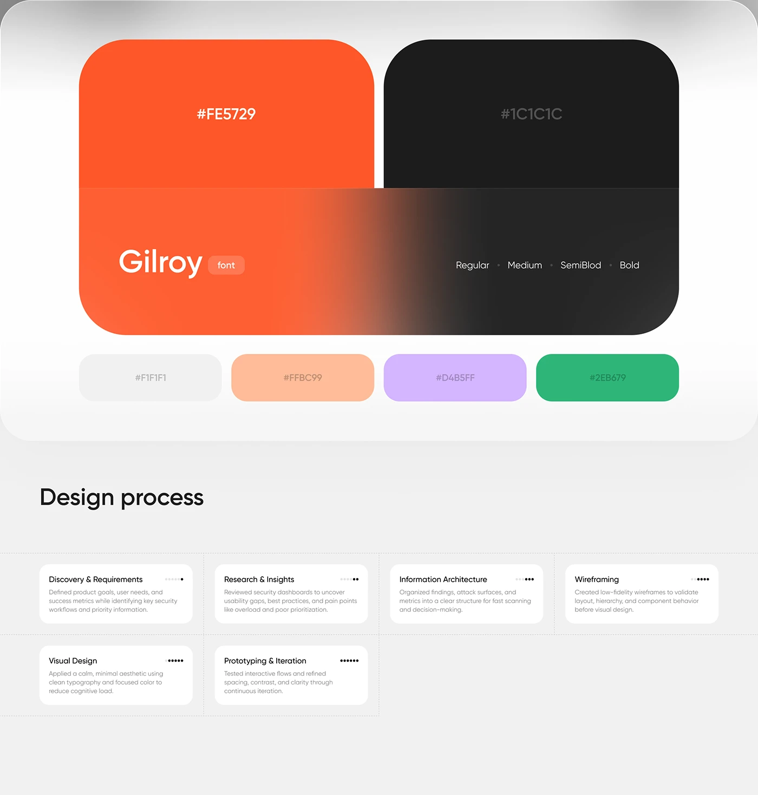
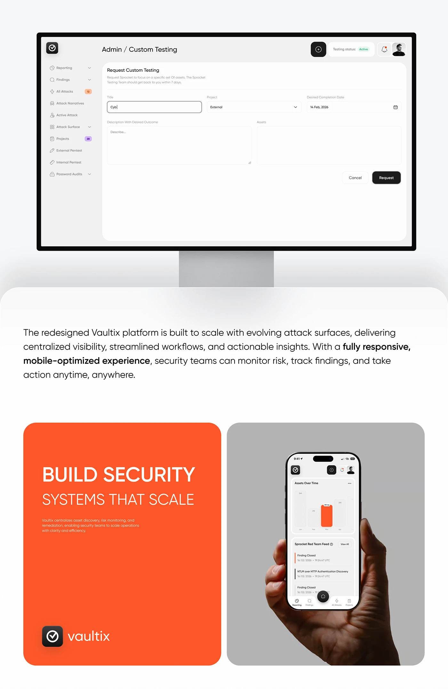
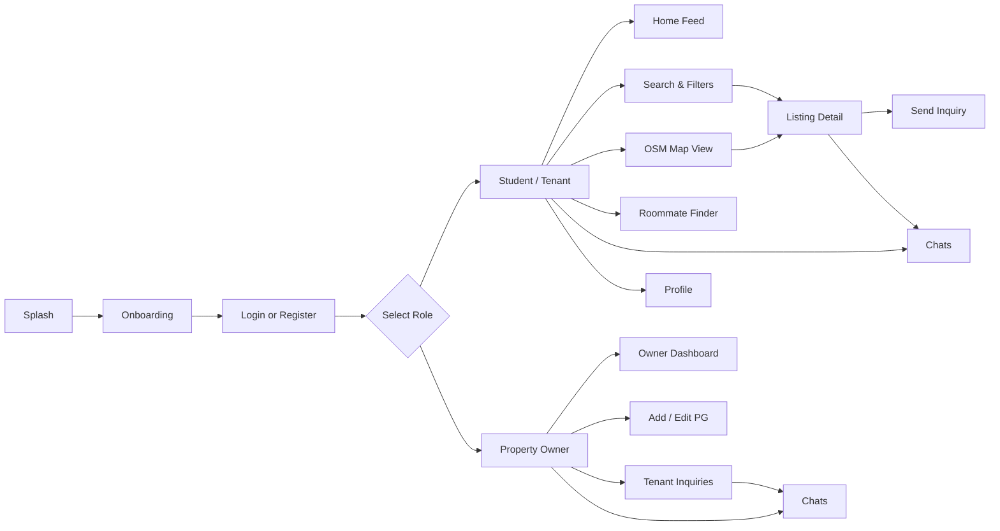
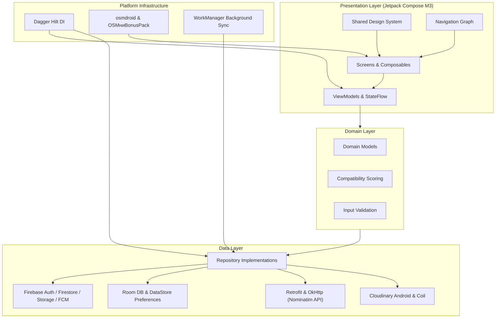

<div align="center">


# StayBuddy

#### PG discovery, roommate matching, owner listings, maps, and real-time chat in one Android app.

<p>
  StayBuddy helps students and working professionals discover PG accommodations, compare locations,
  find compatible roommates through lifestyle quizzes, save favorites, and connect directly with property owners.
</p>

<p>
  <a href="https://github.com/toxicbishop/Stay-Buddy/releases/latest">
    
  </a>
  <a href="https://github.com/toxicbishop/Stay-Buddy/actions/workflows/android.yml">
    
  </a>
  
  
  
  
  <a href="./LICENSE">
    
  </a>
</p>

<p>
  <a href="#download">Download</a>
  &bull;
  <a href="#ui-showcase">UI Showcase</a>
  &bull;
  <a href="#why-staybuddy">Why StayBuddy</a>
  &bull;
  <a href="#features">Features</a>
  &bull;
  <a href="#architecture">Architecture</a>
  &bull;
  <a href="#setup">Setup</a>
  &bull;
  <a href="#contributing">Contributing</a>
  &bull;
  <a href="#license">License</a>
</p>

<p>
  <a href="https://github.com/toxicbishop/Stay-Buddy/releases/tag/v0.1.0">
    
  </a>
  <a href="https://github.com/toxicbishop/Stay-Buddy/releases">
    
  </a>
</p>

<br />



</div>

---

## Download

Pre-built APK binaries are packaged automatically through GitHub Releases and GitHub Actions CI.

| Build | Link | Details |
| :--- | :--- | :--- |
| **Latest Release (v0.1.0)** | [Download v0.1.0 Release](https://github.com/toxicbishop/Stay-Buddy/releases/tag/v0.1.0) | Recommended for installation and testing |
| **Direct APK** | [StayBuddy-debug.apk](https://github.com/toxicbishop/Stay-Buddy/releases/download/v0.1.0/StayBuddy-debug.apk) | Direct APK download link |
| **All Releases** | [View Release History](https://github.com/toxicbishop/Stay-Buddy/releases) | Changelogs and version archives |
| **CI Status** | [Android CI & Auto-Release](https://github.com/toxicbishop/Stay-Buddy/actions/workflows/android.yml) | Automated build verification |

> [!NOTE]
> When installing the debug APK on an Android device, enable **Install unknown apps** for your browser or file manager when prompted.

---

## UI Showcase

StayBuddy is built with a warm, homely Material 3 design system code-named **Hearth** — using evergreen brand tones, paper background surfaces, and clay price highlights.

<div align="center">

| Onboarding & Home Feed | Listing Detail & Filters | Roommate Matching |
| :---: | :---: | :---: |
|  |  |  |

| Map Discovery | Interactive Search | Chat & Inquiries |
| :---: | :---: | :---: |
|  |  |  |

</div>

---

## Why StayBuddy

Finding a PG or compatible roommate usually means jumping between classified portals, mapping apps, messaging platforms, and broker calls. StayBuddy consolidates everything into a unified Android experience:

<table>
  <tr>
    <td width="33%">
      <h3>Discover</h3>
      <p>Browse verified PG listings with detailed rent, room types, amenities, neighborhood info, high-res photos, and live availability.</p>
    </td>
    <td width="33%">
      <h3>Match</h3>
      <p>Take lifestyle and habit quizzes to discover compatible roommates based on study habits, sleep schedules, cleanliness, and diet.</p>
    </td>
    <td width="33%">
      <h3>Connect</h3>
      <p>In-app real-time messaging with property owners and potential roommates, booking inquiries, and instant notifications.</p>
    </td>
  </tr>
</table>

---

## Features

<table>
  <tr>
    <td width="50%">
      <h3>Student / Tenant Experience</h3>
      <ul>
        <li><b>Tailored Onboarding:</b> Role-based account creation.</li>
        <li><b>Authentication:</b> Email/Password and one-tap Google Sign-In.</li>
        <li><b>Listing Discovery:</b> Search by city, rent budget, room sharing, gender preference, and essential amenities (Wi-Fi, AC, Food).</li>
        <li><b>Listing Details:</b> Full-screen image carousels, owner bio, and exact amenity breakdown.</li>
        <li><b>OpenStreetMap Integration:</b> Explore nearby transit, colleges, and neighborhood landmarks without proprietary API keys.</li>
        <li><b>Roommate Matching:</b> Compatibility score algorithm based on lifestyle quiz answers.</li>
        <li><b>Live Chat:</b> Real-time messaging backed by Cloud Firestore.</li>
        <li><b>Favorites & Offline Cache:</b> Save properties locally with Room for offline viewing.</li>
      </ul>
    </td>
    <td width="50%">
      <h3>Owner Experience</h3>
      <ul>
        <li><b>Owner Dashboard:</b> Manage all listed properties, occupancy, and availability from a single screen.</li>
        <li><b>Listing Studio:</b> Step-by-step listing creation with photo uploads via Cloudinary.</li>
        <li><b>Location Pinning:</b> Precise geocoding and address search via OpenStreetMap Nominatim.</li>
        <li><b>Tenant Inquiries:</b> Review incoming inquiries and convert prospects directly to chat.</li>
        <li><b>Push Notifications:</b> Instant FCM push notifications for new messages and inquiry alerts.</li>
        <li><b>Verification Badges:</b> Verified owner credentials and property tags.</li>
      </ul>
    </td>
  </tr>
</table>

---

## Product Experience Flow



---

## Architecture

StayBuddy follows strict **MVVM (Model-View-ViewModel)** with Google's recommended clean architecture practices, repository pattern, and dependency injection via Hilt:



---

## Tech Stack

| Layer | Technology | Description |
| :--- | :--- | :--- |
| **Language** | Kotlin 2.1.0 | Modern idiomatic Kotlin with Coroutines & StateFlow |
| **UI Framework** | Jetpack Compose + Material 3 | Declarative UI following the "Hearth" design specification |
| **Architecture** | MVVM + Repository Pattern | Clean separation of UI, business logic, and data sources |
| **Dependency Injection** | Dagger Hilt 2.56.2 | Standard Android dependency injection |
| **Backend & Cloud** | Firebase Platform | Authentication, Firestore, Cloud Storage, FCM, Remote Config |
| **Local Cache** | Room 2.6.1 + DataStore | Offline listing cache, search history, and user preferences |
| **Maps & Location** | osmdroid + OSMниBonusPack | Free, open-source OpenStreetMap integration |
| **Geocoding** | Nominatim REST API | Address lookup and reverse geocoding via Retrofit & OkHttp |
| **Image Pipeline** | Coil 2.7.0 + Cloudinary SDK | Asynchronous image loading and cloud media uploads |
| **Build System** | Gradle 8.11 + AGP 8.9.1 | Version Catalog (`libs.versions.toml`) |

---

## Project Structure

```text
Stay-Buddy/
├── app/
│   ├── build.gradle.kts
│   └── src/main/
│       ├── AndroidManifest.xml
│       ├── java/com/example/staybuddy/
│       │   ├── data/           # APIs, repositories, models, Room DB, managers
│       │   ├── di/             # Hilt dependency injection modules
│       │   ├── domain/         # Domain use cases and scoring models
│       │   ├── notifications/  # FCM push notification handlers
│       │   ├── ui/             # Compose screens, components, theme ("Hearth")
│       │   └── util/           # Formatters, constants, validators
│       └── res/                # Vector drawables, mipmaps, icons
├── assets/                     # App logo, branding, and release banners
├── design/                     # UI specs, Behance mockups, and prototypes
├── functions/                  # Firebase Cloud Functions (Node.js)
├── stay-buddy-backend/         # Push notification microservice
├── stay-buddy-worker/          # Cloudflare sync workers
├── gradle/                     # Gradle wrapper and libs.versions.toml
├── .github/workflows/          # Android CI and GitHub auto-release workflows
├── gradle.properties           # Project build settings and AndroidX configuration
├── firestore.rules             # Cloud Firestore security rules
├── firestore.indexes.json      # Firestore query indexes
└── LICENSE                     # GNU General Public License v3.0
```

---

## Setup & Local Development

### Prerequisites

- **Android Studio:** Ladybug (2024.2.1) or newer
- **JDK:** Version 21 (or JDK 17 minimum)
- **Android SDK:** `minSdk 26`, `compileSdk / targetSdk 36`

### 1. Clone the Repository

```bash
git clone https://github.com/toxicbishop/Stay-Buddy.git
cd Stay-Buddy
```

### 2. Configure Firebase

1. Create a project in the [Firebase Console](https://console.firebase.google.com/).
2. Enable **Authentication** (Email/Password & Google Sign-In), **Cloud Firestore**, **Firebase Storage**, and **Cloud Messaging**.
3. Register an Android app using package name:
   ```text
   com.example.staybuddy
   ```
4. Download `google-services.json` and place it in:
   ```text
   app/google-services.json
   ```
5. *(Optional for Google Sign-In)*: Add your debug SHA-1 and SHA-256 certificate fingerprints in Firebase project settings.

### 3. Build & Run

Build the debug APK:
```bash
./gradlew :app:assembleDebug
```
*(On Windows PowerShell: `.\gradlew.bat :app:assembleDebug`)*

Install directly to an attached Android device or running emulator:
```bash
./gradlew :app:installDebug
```

Run tests and lint verification:
```bash
./gradlew test
./gradlew :app:lintDebug
```

---

## Contributing

Contributions are welcome! Please follow these steps to keep the codebase clean:

1. Fork or branch from `master`:
   ```bash
   git checkout -b feat/your-feature-name
   ```
2. Make small, focused changes adhering to **AGENTS.md** and **Material 3** guidelines.
3. Test your build locally before committing:
   ```bash
   ./gradlew :app:assembleDebug
   ```
4. Commit using conventional commit format (`feat:`, `fix:`, `docs:`, `refactor:`):
   ```bash
   git commit -m "feat: add neighborhood transit filter"
   ```
5. Open a pull request against `master`.

---

## License

This project is licensed under the **GNU General Public License v3.0** — see the [LICENSE](LICENSE) file for complete details.

---

## Star History

<a href="https://www.star-history.com/#toxicbishop/Stay-Buddy&Date">
 <picture>
   <source media="(prefers-color-scheme: dark)" srcset="https://api.star-history.com/chart?repos=toxicbishop/Stay-Buddy&type=Date&theme=dark" />
   <source media="(prefers-color-scheme: light)" srcset="https://api.star-history.com/chart?repos=toxicbishop/Stay-Buddy&type=Date" />
   
 </picture>
</a>

---

<div align="center">

**StayBuddy** &bull; Made with ❤️ for students and professionals across India.

<br />

<a href="https://github.com/toxicbishop/Stay-Buddy/releases/tag/v0.1.0">
  
</a>

</div>
