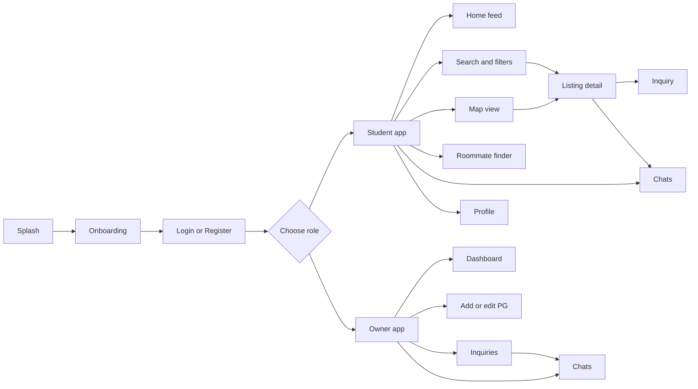
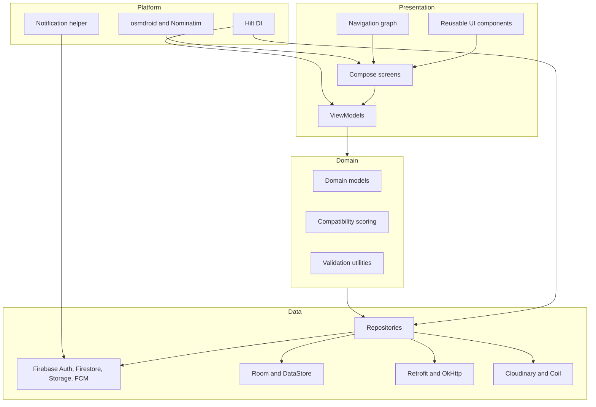

<div align="center">


# StayBuddy

#### PG discovery, roommate matching, owner listings, maps, and chat in one Android app.

<p>
  StayBuddy helps students and working professionals discover PG accommodations, compare locations,
  find compatible roommates, save favorites, and connect directly with property owners.
</p>

<p>
  <a href="https://github.com/aasavchauhan/StayBuddy/releases/latest">
    
  </a>
  <a href="https://github.com/aasavchauhan/StayBuddy/actions/workflows/android.yml">
    
  </a>
  
  
  
  
</p>

<p>
  <a href="#download">Download</a>
  |
  <a href="#why-staybuddy">Why StayBuddy</a>
  |
  <a href="#features">Features</a>
  |
  <a href="#architecture">Architecture</a>
  |
  <a href="#setup">Setup</a>
  |
  <a href="#contributing">Contributing</a>
</p>

<p>
  <a href="https://github.com/aasavchauhan/StayBuddy/releases/latest">
    
  </a>
  <a href="https://github.com/aasavchauhan/StayBuddy/releases">
    
  </a>
</p>

</div>

---

## Download

The latest APK is published automatically through GitHub Releases.

| Build | Link | Best for |
| --- | --- | --- |
| Latest release | [Download from latest release](https://github.com/aasavchauhan/StayBuddy/releases/latest) | Normal installation and sharing |
| Release history | [View all releases](https://github.com/aasavchauhan/StayBuddy/releases) | Older versions and release notes |
| CI status | [Android workflow](https://github.com/aasavchauhan/StayBuddy/actions/workflows/android.yml) | Build verification |

Open the latest release, expand **Assets**, and download the APK attached to the release.

## Why StayBuddy

Finding a PG or a good roommate usually means switching between scattered listings, maps, chat apps, and owner contacts. StayBuddy turns that flow into one focused Android experience.

<table>
  <tr>
    <td width="33%">
      <h3>Discover</h3>
      <p>Browse PG listings with price, room type, location, amenities, owner details, images, and availability.</p>
    </td>
    <td width="33%">
      <h3>Match</h3>
      <p>Use roommate posts and compatibility preferences to find people whose lifestyle fits yours.</p>
    </td>
    <td width="33%">
      <h3>Connect</h3>
      <p>Chat with owners or roommates, manage inquiries, save favorites, and continue the search later.</p>
    </td>
  </tr>
</table>

## Features

<table>
  <tr>
    <td width="50%">
      <h3>Student Flow</h3>
      <ul>
        <li>Onboarding and role-based registration</li>
        <li>Email/password and Google Sign-In authentication</li>
        <li>Home feed for PG listing discovery</li>
        <li>Advanced search by city, area, price, room type, gender, and amenities</li>
        <li>Listing detail screen with media, owner info, location, and inquiry actions</li>
        <li>Favorites and local search history</li>
        <li>Roommate posts and compatibility quiz</li>
        <li>Direct chat with owners and potential roommates</li>
      </ul>
    </td>
    <td width="50%">
      <h3>Owner Flow</h3>
      <ul>
        <li>Owner dashboard for listing management</li>
        <li>Add and edit PG listings</li>
        <li>Photo upload support through Cloudinary</li>
        <li>Location picker and address search</li>
        <li>Inquiry management</li>
        <li>Chat with interested tenants</li>
        <li>Verified listing and premium listing hooks</li>
        <li>Push notification support through FCM</li>
      </ul>
    </td>
  </tr>
</table>

## Product Experience



## Architecture

StayBuddy follows a practical MVVM structure with repository-based data access and dependency injection through Hilt.



## Tech Stack

| Layer | Tools |
| --- | --- |
| Language | Kotlin 2.1.0 |
| UI | Jetpack Compose, Material 3, Compose Navigation |
| Architecture | MVVM, Repository pattern, Hilt dependency injection |
| Backend | Firebase Auth, Cloud Firestore, Firebase Storage, FCM, Analytics, Remote Config |
| Local storage | Room, DataStore Preferences |
| Maps | osmdroid, OSMBonusPack, Google Play Services Location |
| Geocoding | Nominatim API with Retrofit and OkHttp |
| Media | Coil, Cloudinary Android SDK |
| Testing | JUnit, AndroidX Test, Espresso, Compose UI Test |
| Build | Gradle Kotlin DSL, Version Catalog, Android Gradle Plugin 8.9.1 |

## Screens

| Area | Screens |
| --- | --- |
| Authentication | Splash, onboarding, login, register, finish registration |
| Student | Home, search, map, favorites, listing detail, roommate list, compatibility quiz |
| Owner | Dashboard, add listing, owner inquiries |
| Shared | Chat list, chat screen, profile, edit profile |

## Project Structure

```text
StayBuddy/
|-- app/
|   |-- build.gradle.kts
|   `-- src/main/
|       |-- AndroidManifest.xml
|       |-- java/com/example/staybuddy/
|       |   |-- data/           # APIs, repositories, models, Room, managers
|       |   |-- di/             # Hilt modules
|       |   |-- domain/         # Domain models
|       |   |-- notifications/  # FCM service and notification helper
|       |   |-- ui/             # Compose screens, components, navigation, theme
|       |   |-- util/           # Feature utilities
|       |   `-- utils/          # Constants, validation, extensions
|       `-- res/                # Themes, icons, XML resources
|-- gradle/                     # Wrapper and version catalog
|-- .github/workflows/          # Android CI and auto-release workflow
|-- firestore.rules             # Firestore security rules
|-- firestore.indexes.json      # Firestore indexes
|-- firebase.json               # Firebase CLI config
`-- README.md
```

## Setup

### Requirements

| Tool | Version |
| --- | --- |
| Android Studio | Ladybug or newer |
| JDK | 17 |
| Kotlin | 2.1.0 |
| Android Gradle Plugin | 8.9.1 |
| Minimum SDK | 26 |
| Target SDK | 36 |

### Clone

```bash
git clone https://github.com/aasavchauhan/StayBuddy.git
cd StayBuddy
```

### Firebase Configuration

Create a Firebase project and enable:

| Firebase service | Used for |
| --- | --- |
| Authentication | Email/password and Google Sign-In |
| Cloud Firestore | App data, listings, chats, roommate posts, inquiries |
| Firebase Storage | Listing and profile media |
| Cloud Messaging | Push notifications |
| Analytics | App analytics |
| Remote Config | Remote app configuration and update prompts |

Register an Android app with package:

```text
com.example.staybuddy
```

Download `google-services.json` and place it here:

```text
app/google-services.json
```

For Google Sign-In, add your debug SHA-1 and SHA-256 fingerprints in Firebase Console.

### Build

```bash
./gradlew assembleDebug
```

Windows PowerShell:

```powershell
.\gradlew.bat assembleDebug
```

Install on a connected device:

```bash
./gradlew installDebug
```

## Firebase Collections

```text
users
pg_listings
roommate_posts
chats
messages
favorites
inquiries
```

Deploy Firestore rules and indexes:

```bash
firebase deploy --only firestore:rules,firestore:indexes
```

## Commands

| Command | Purpose |
| --- | --- |
| `./gradlew assembleDebug` | Build debug APK |
| `./gradlew installDebug` | Install debug APK |
| `./gradlew test` | Run unit tests |
| `./gradlew connectedAndroidTest` | Run Android instrumented tests |
| `./gradlew clean` | Clean generated files |

## Release Process

The repository includes an Android CI and auto-release workflow.

| Trigger | Result |
| --- | --- |
| Push to `main` or `master` | Builds APKs and creates a GitHub Release |
| Push tag matching `v*` | Creates a versioned release |
| Manual workflow dispatch | Builds and publishes a release manually |

Release assets are uploaded from:

```text
app/build/outputs/apk/release/*.apk
app/build/outputs/apk/debug/*.apk
```

## Roadmap

| Status | Item |
| --- | --- |
| Done | PG listing discovery |
| Done | Authentication and onboarding |
| Done | Student and owner role flows |
| Done | Owner dashboard and listing creation |
| Done | Roommate posts and compatibility quiz |
| Done | Firestore-backed chat |
| Done | Favorites and search history |
| Done | OpenStreetMap integration |
| Next | Add real screenshots and demo GIFs |
| Next | Reviews and ratings |
| Next | Multi-language support |
| Next | Smarter roommate recommendations |

## Contributing

Contributions are welcome. A good PR is small, focused, tested, and easy to review.

### Workflow

```bash
git checkout -b feature/your-feature
git add .
git commit -m "feat: describe your feature"
git push origin feature/your-feature
```

Then open a pull request with:

| Include | Why |
| --- | --- |
| Summary | Explain what changed |
| Screenshots | Required for UI changes |
| Test notes | Show what you verified |
| Related issue | Connect the work to a bug or feature request |

### Commit Style

| Prefix | Use for |
| --- | --- |
| `feat:` | New feature |
| `fix:` | Bug fix |
| `docs:` | Documentation |
| `refactor:` | Code restructuring |
| `test:` | Tests |
| `chore:` | Build, tooling, maintenance |

## Notes

- OpenStreetMap is used through osmdroid, so Google Maps API keys are not required.
- Nominatim is used for address search and geocoding.
- Cloudinary metadata is configured in `AndroidManifest.xml`.
- Release builds enable minification and resource shrinking.
- Production deployments should review Firebase rules, storage rules, signing config, and exposed keys.

## License

No license file has been added yet. Add a `LICENSE` file before distributing or reusing this project publicly.

---

## Star History

<a href="https://www.star-history.com/?repos=aasavchauhan%2FStayBuddy&type=date&legend=top-left">
 <picture>
   <source media="(prefers-color-scheme: dark)" srcset="https://api.star-history.com/chart?repos=aasavchauhan/StayBuddy&type=date&theme=dark&legend=top-left" />
   <source media="(prefers-color-scheme: light)" srcset="https://api.star-history.com/chart?repos=aasavchauhan/StayBuddy&type=date&legend=top-left" />
   
 </picture>
</a>

---

<div align="center">

**StayBuddy**  
Built with Kotlin, Jetpack Compose, Firebase, Room, Hilt, and OpenStreetMap.

<br />

<a href="https://github.com/aasavchauhan/StayBuddy/releases/latest">
  
</a>

</div>
